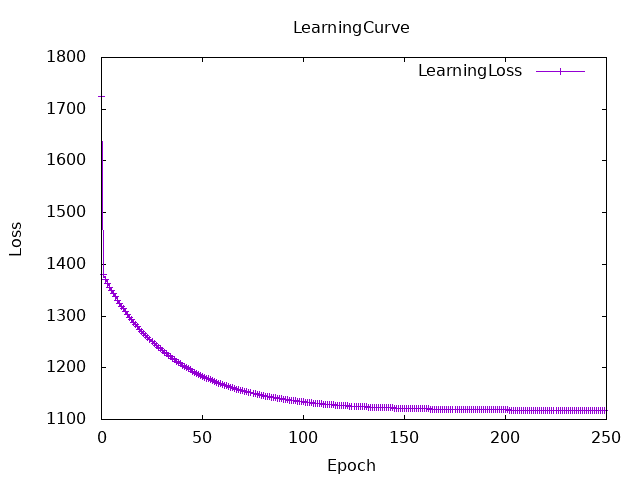
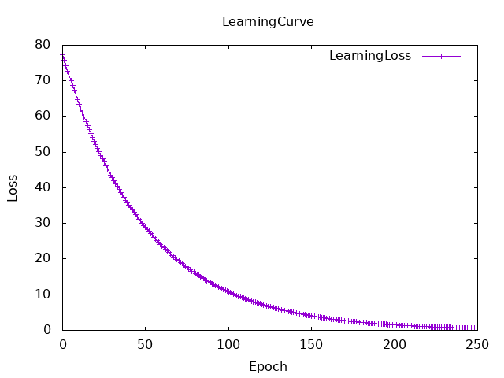
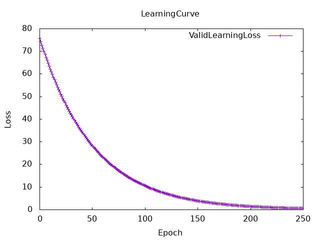

## 3.Train linear regression model with sample data.
### the output of my initial linear function test
correct answer: 130.0
estimated: 745.0
******
correct answer: 195.0
estimated: 935.0
******
correct answer: 218.0
estimated: 1400.0
******
correct answer: 166.0
estimated: 900.0
******
correct answer: 163.0
estimated: 1085.0
******
correct answer: 155.0
estimated: 640.0
******
correct answer: 204.0
estimated: 765.0
******
correct answer: 270.0
estimated: 985.0
******
correct answer: 205.0
estimated: 635.0
******
correct answer: 127.0
estimated: 395.0
******
correct answer: 260.0
estimated: 1060.0
******
correct answer: 249.0
estimated: 1300.0
******
correct answer: 251.0
estimated: 1280.0
******
correct answer: 158.0
estimated: 580.0
******
correct answer: 167.0
estimated: 870.0
******

### 3.g The final trained results
a = 0.5642019
b = 92.85766
cost = 1117.6555

learning rate:
  rateA = 0.00001
  rateB = 0.1
epoch = 250
initial value:
  initialA = 0.1
  initialB = 0.1

learning curve

analysis: I changed the learning rate for a and b because only a’s grad has the coefficient xs and I thought it causes the difference of learning speed between a and b. This solved the problem of b always converging to the initial value.
However, I don't think this program works well because the convergence values of a and b also changed considerably when the combination of initial values and learning rate was changed.

## 5.Predict something with Linear Regression
### 5.i My training results
a = 0.2869446
b = -0.98557657
(actual answer is a = 0.207, b = -1.0548)
cost = 0.5778215

learning rate:
  rateA = 0.00005
  rateB = 0.0012
epoch = 250
initial value:
  initialA = 1.0
  initialB = 1.0

learning curve for train data

learning curve for valid data

analysis: As before, I adjusted parameters to make a and b converge to the correct values. If I change the values even slightly, a and b will converge to different values so I think this program also doesn't work well.