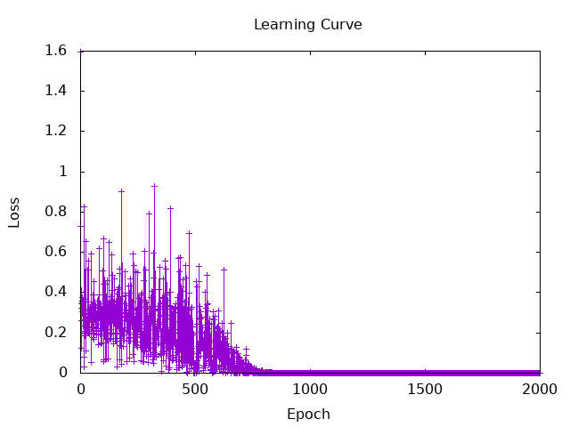
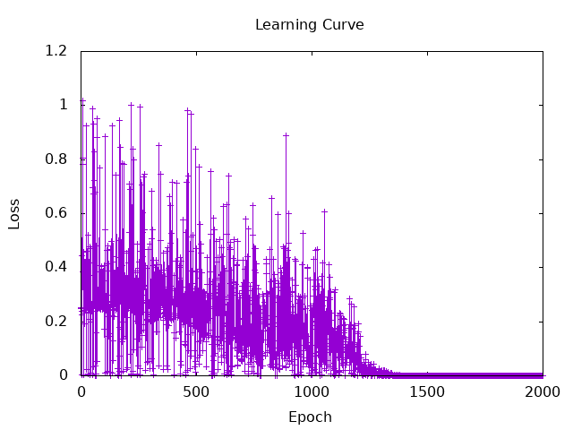
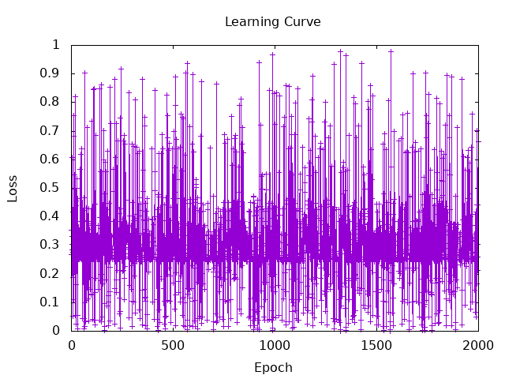

# A Simple Perceptron
## My results
learning rate = 0.1  
epoch = 150  
$ stack run session4-perseptron-and-gate  
initial weights [0.48967326,0.21364456]  
initial bias 0.97732216  
initial error[0.0,-1.0,-1.0,-1.0]  
final weights [0.18967327,0.21364456]  
final bias -0.22267789  
final error[0.0,0.0,0.0,0.0]    


# A Multi-layer Perceptron
## 2.b My explanation about the code
  
Define the type of MLPSpec and MLP.
  
```haskell:MlpXor.hs
data MLPSpec = MLPSpec
  { feature_counts :: [Int],   -- 層のサイズ
    nonlinearitySpec :: Tensor -> Tensor  -- 活性化関数
  }

data MLP = MLP
  { layers :: [Linear],   -- 線形層のリスト
    nonlinearity :: Tensor -> Tensor   -- 活性化関数
  }
  deriving (Generic, Parameterized)
```
  
MLPSpec and MLP correspond to spec and f of the typeclass Randomizable, respectively.  
Sample is a function that randomly generates MLP based on information of MLPSpec.
  
```haskell:MlpXor.hs
-- How to make random MLP from MLPSpec
instance Randomizable MLPSpec MLP where
  sample MLPSpec {..} = do
    let layer_sizes = mkLayerSizes feature_counts
    linears <- mapM sample $ map (uncurry LinearSpec) layer_sizes
    return $ MLP {layers = linears, nonlinearity = nonlinearitySpec}
    where
      mkLayerSizes (a : (b : t)) =
        scanl shift (a, b) t
        where
          shift (a, b) c = (b, c)
```
  
Apply functions of every layer to input. Functions to be applied to input are in the list, specifically in the following form.  
[Σ(w*x+b), nonlinearity, Σ(w*x+b) ..]
  
```haskell:MlpXor.hs
mlp :: MLP -> Tensor -> Tensor
mlp MLP {..} input = foldl' revApply input $ intersperse nonlinearity $ map linear layers
  where
    revApply x f = f x
```
  
batchSize is the size of a dataset when it is divided into several groups.  
numIters is the number of iterations.
  
```haskell:MlpXor.hs
batchSize = 2

numIters = 2000

model :: MLP -> Tensor -> Tensor
model params t = mlp params t
```
  
Initialize the MLP by specifying the layer size and activation function.
  
```haskell:MlpXor.hs
main :: IO ()
main = do
  -- generate MLP
  init <-
    sample $
      MLPSpec
        { feature_counts = [2, 2, 1],
          nonlinearitySpec = Torch.tanh
        }
```
  
Update training data, calculate MSE, and update weights and bias at each iteration of learning.
  
```haskell:MlpXor.hs
  trained <- foldLoop init numIters $ \state i -> do
    -- generate learning data
    input <- randIO' [batchSize, 2] >>= return . (toDType Float) . (gt 0.5)
    -- calculate the MSE
    let (y, y') = (tensorXOR input, squeezeAll $ model state input)
        loss = mseLoss y y'
    when (i `mod` 100 == 0) $ do
      putStrLn $ "Iteration: " ++ show i ++ " | Loss: " ++ show loss
    -- update weights and bias
    (newState, _) <- runStep state optimizer loss 1e-1
    return newState
```
  
Output the results and function to compute the correct output (y)
  
```haskell:MlpXor.hs
  putStrLn "Final Model:"
  putStrLn $ "0, 0 => " ++ (show $ squeezeAll $ model trained (asTensor [0, 0 :: Float]))
  putStrLn $ "0, 1 => " ++ (show $ squeezeAll $ model trained (asTensor [0, 1 :: Float]))
  putStrLn $ "1, 0 => " ++ (show $ squeezeAll $ model trained (asTensor [1, 0 :: Float]))
  putStrLn $ "1, 1 => " ++ (show $ squeezeAll $ model trained (asTensor [1, 1 :: Float]))
  return ()
  where
    optimizer = GD
    tensorXOR :: Tensor -> Tensor
    tensorXOR t = (1 - (1 - a) * (1 - b)) * (1 - (a * b))
      where
        a = select 1 0 t
        b = select 1 1 t
```
  
Here is the definition of the function I referred to.
  
```haskell:NN.hs
type Parameter = IndependentTensor

class Randomizable spec f | spec -> f where
  sample :: spec -> IO f

data Linear = Linear
  { weight :: Parameter,
    bias :: Parameter
  }
  deriving (Show, Generic, Parameterized)

data LinearSpec = LinearSpec
  { in_features :: Int,
    out_features :: Int
  }
  deriving (Show, Eq)

instance Randomizable LinearSpec Linear where
  sample LinearSpec {..} = do ..

linear :: Linear -> Tensor -> Tensor
```


```haskell:Functional.hs
squeezeAll ::
  -- | input
  Tensor ->
  -- | output
  Tensor
squeezeAll t = unsafePerformIO $ cast1 ATen.squeeze_t t

tanh ::
  -- | input
  Tensor ->
  -- | output
  Tensor
tanh t = unsafePerformIO $ cast1 ATen.tanh_t t

mseLoss ::
  -- | target tensor
  Tensor ->
  -- | input
  Tensor ->
  -- | output
  Tensor
mseLoss target t = unsafePerformIO $ cast3 ATen.mse_loss_ttl t target ATen.kMean
```

```haskell:Optim.hs
runStep ::
  forall model optim parameters gradients tensors dtype device.
  ( Parameterized model,
    parameters ~ Parameters model,
    HasGrad (HList parameters) (HList gradients),
    tensors ~ gradients,
    HMap' ToDependent parameters tensors,
    ATen.Castable (HList gradients) [D.ATenTensor],
    Optimizer optim gradients tensors dtype device,
    HMapM' IO MakeIndependent tensors parameters
  ) =>
  model ->
  optim ->
  Loss device dtype ->
  LearningRate device dtype ->
  IO (model, optim)
```
  
  
  
## 2.d The impact of different activation functions
### using tanh(rate = 0.1):  
Iteration: 100 | Loss: Tensor Float []  0.4426   
Iteration: 200 | Loss: Tensor Float []  0.2995   
Iteration: 300 | Loss: Tensor Float []  0.3243   
Iteration: 400 | Loss: Tensor Float []  6.3940e-2  
Iteration: 500 | Loss: Tensor Float []  2.6677e-2  
Iteration: 600 | Loss: Tensor Float []  0.3094   
Iteration: 700 | Loss: Tensor Float []  5.0927e-2  
Iteration: 800 | Loss: Tensor Float []  3.0997e-4  
Iteration: 900 | Loss: Tensor Float []  2.9338e-5  
Iteration: 1000 | Loss: Tensor Float []  1.0861e-5  
Iteration: 1100 | Loss: Tensor Float []  1.3003e-7  
Iteration: 1200 | Loss: Tensor Float []  4.5230e-10  
Iteration: 1300 | Loss: Tensor Float []  1.4211e-12  
Iteration: 1400 | Loss: Tensor Float []  1.2381e-12  
Iteration: 1500 | Loss: Tensor Float []  6.3949e-14  
Iteration: 1600 | Loss: Tensor Float []  1.7764e-14  
Iteration: 1700 | Loss: Tensor Float []  3.1974e-14  
Iteration: 1800 | Loss: Tensor Float []  2.8422e-14  
Iteration: 1900 | Loss: Tensor Float []  1.4211e-14  
Iteration: 2000 | Loss: Tensor Float []  7.1054e-15  
Final Model:  
0, 0 => Tensor Float []  0.0000  
0, 1 => Tensor Float []  1.0000   
1, 0 => Tensor Float []  1.0000   
1, 1 => Tensor Float []  1.1921e-7  
  
Learning Curve:  
  


### The result of using sigmoid(rate = 0.3):  
Iteration: 100 | Loss: Tensor Float []  0.1733   
Iteration: 200 | Loss: Tensor Float []  0.2662   
Iteration: 300 | Loss: Tensor Float []  2.5253e-2  
Iteration: 400 | Loss: Tensor Float []  0.2077   
Iteration: 500 | Loss: Tensor Float []  0.4701   
Iteration: 600 | Loss: Tensor Float []  0.3069   
Iteration: 700 | Loss: Tensor Float []  0.3308   
Iteration: 800 | Loss: Tensor Float []  0.2536   
Iteration: 900 | Loss: Tensor Float []  0.4921   
Iteration: 1000 | Loss: Tensor Float []  0.1143   
Iteration: 1100 | Loss: Tensor Float []  0.1744   
Iteration: 1200 | Loss: Tensor Float []  1.2213e-4  
Iteration: 1300 | Loss: Tensor Float []  1.8360e-3  
Iteration: 1400 | Loss: Tensor Float []  5.2488e-4  
Iteration: 1500 | Loss: Tensor Float []  9.2643e-5  
Iteration: 1600 | Loss: Tensor Float []  1.1995e-6  
Iteration: 1700 | Loss: Tensor Float []  5.0101e-8  
Iteration: 1800 | Loss: Tensor Float []  5.3535e-9  
Iteration: 1900 | Loss: Tensor Float []  1.3848e-10  
Iteration: 2000 | Loss: Tensor Float []  1.8591e-11  
Final Model:  
0, 0 => Tensor Float []  3.2187e-6  
0, 1 => Tensor Float []  1.0000   
1, 0 => Tensor Float []  1.0000   
1, 1 => Tensor Float []  6.2585e-6  
  
Learning Curve:  


### using step function(rate = 0.1):  
Iteration: 100 | Loss: Tensor Float []  0.7342   
Iteration: 200 | Loss: Tensor Float []  0.3292   
Iteration: 300 | Loss: Tensor Float []  0.1047   
Iteration: 400 | Loss: Tensor Float []  0.3884   
Iteration: 500 | Loss: Tensor Float []  0.4630   
Iteration: 600 | Loss: Tensor Float []  0.2523   
Iteration: 700 | Loss: Tensor Float []  0.4717   
Iteration: 800 | Loss: Tensor Float []  0.3581   
Iteration: 900 | Loss: Tensor Float []  0.1183   
Iteration: 1000 | Loss: Tensor Float []  0.1379   
Iteration: 1100 | Loss: Tensor Float []  7.1484e-2  
Iteration: 1200 | Loss: Tensor Float []  0.3039   
Iteration: 1300 | Loss: Tensor Float []  0.2507   
Iteration: 1400 | Loss: Tensor Float []  0.2792   
Iteration: 1500 | Loss: Tensor Float []  2.2203e-2  
Iteration: 1600 | Loss: Tensor Float []  0.2495   
Iteration: 1700 | Loss: Tensor Float []  0.3391   
Iteration: 1800 | Loss: Tensor Float []  0.4932   
Iteration: 1900 | Loss: Tensor Float []  0.3251   
Iteration: 2000 | Loss: Tensor Float []  0.6642   
Final Model:  
0, 0 => Tensor Float []  0.6740   
0, 1 => Tensor Float []  0.6740   
1, 0 => Tensor Float []  0.6740   
1, 1 => Tensor Float []  0.6740  
  
Learning Curve:  


### analysis
$$
 \Delta w_i = - \alpha\frac{\partial MSE}{\partial w_i} 
$$
