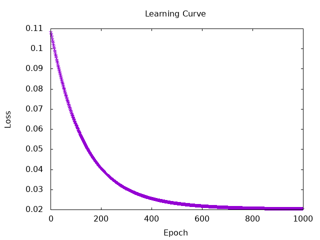
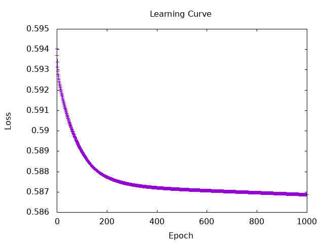

# Evaluating a classification model
## 3.a Analysis of metrics
my result and evaluation  
・activation function: sigmoid  
・loss function: mseLoss  
・learning rate: 0.01
```
Iteration: 100 | Loss: Tensor Float []  6.7851e-2
Iteration: 200 | Loss: Tensor Float []  4.8525e-2
Iteration: 300 | Loss: Tensor Float []  3.7325e-2
Iteration: 400 | Loss: Tensor Float []  3.0751e-2
Iteration: 500 | Loss: Tensor Float []  2.6816e-2
Iteration: 600 | Loss: Tensor Float []  2.4414e-2
Iteration: 700 | Loss: Tensor Float []  2.2920e-2
Iteration: 800 | Loss: Tensor Float []  2.1976e-2
Iteration: 900 | Loss: Tensor Float []  2.1372e-2
Iteration: 1000 | Loss: Tensor Float []  2.0980e-2
Actual value:
Tensor Float [50] [ 0.9500   ,  0.6300   ,  0.6600   ,  0.7800   ,  0.9100   ,  0.6200   ,  0.5200   ,  0.6100   ,  0.5800   ,  0.5700   ,  0.6100   ,  0.5400   ,  0.5600   ,  0.5900   ,  0.4900   ,  0.7200   ,  0.7600   ,  0.6500   ,  0.5200   ,  0.6000   ,  0.5800   ,  0.4200   ,  0.7700   ,  0.7300   ,  0.9400   ,  0.9100   ,  0.9200   ,  0.7100   ,  0.7100   ,  0.6900   ,  0.9500   ,  0.7400   ,  0.7300   ,  0.8600   ,  0.7100   ,  0.6400   ,  0.5500   ,  0.5800   ,  0.6100   ,  0.6700   ,  0.6600   ,  0.5300   ,  0.7900   ,  0.9200   ,  0.8700   ,  0.9200   ,  0.9100   ,  0.9300   ,  0.8400   ,  0.8000   ]
Predicted value:
Tensor Float [50] [ 0.6961   ,  0.6961   ,  0.6961   ,  0.6961   ,  0.6961   ,  0.6961   ,  0.6961   ,  0.6961   ,  0.6961   ,  0.6961   ,  0.6961   ,  0.6961   ,  0.6961   ,  0.6961   ,  0.6961   ,  0.6961   ,  0.6961   ,  0.6961   ,  0.6961   ,  0.6961   ,  0.6961   ,  0.6961   ,  0.6961   ,  0.6961   ,  0.6961   ,  0.6961   ,  0.6961   ,  0.6961   ,  0.6961   ,  0.6961   ,  0.6961   ,  0.6961   ,  0.6961   ,  0.6961   ,  0.6961   ,  0.6961   ,  0.6961   ,  0.6961   ,  0.6961   ,  0.6961   ,  0.6961   ,  0.6961   ,  0.6961   ,  0.6961   ,  0.6961   ,  0.6961   ,  0.6961   ,  0.6961   ,  0.6961   ,  0.6961   ]
Actual value:
Tensor Bool [50] [ 1,  0,  1,  1,  1,  0,  0,  0,  0,  0,  0,  0,  0,  0,  0,  1,  1,  1,  0,  0,  0,  0,  1,  1,  1,  1,  1,  1,  1,  1,  1,  1,  1,  1,  1,  0,  0,  0,  0,  1,  1,  0,  1,  1,  1,  1,  1,  1,  1,  1]
Predicted value:
Tensor Bool [50] [ 1,  1,  1,  1,  1,  1,  1,  1,  1,  1,  1,  1,  1,  1,  1,  1,  1,  1,  1,  1,  1,  1,  1,  1,  1,  1,  1,  1,  1,  1,  1,  1,  1,  1,  1,  1,  1,  1,  1,  1,  1,  1,  1,  1,  1,  1,  1,  1,  1,  1]
Tensor Float [2,2] [[ 0.0000,  20.0000   ],
                    [ 0.0000,  30.0000   ]]
Accuracy: [0.6000 0.6000]
Precision: [0.0000 0.6000]
Recall: [0.0000 1.0000]
F1 Score: [0.0000 0.7500]
Macro F1 Score: 0.3750
Weighted F1 Score: 0.4500
Micro F1 Score: 0.6000
```

Learning Curve:  
  
  
The loss converged to 0.02 and all output values were almost the same. I used imbalanced dataset, so the microF1score was reasonably large, but the MacroF1score was small, which indicates that the model was not accurate.
  
  
## 4.a Loss function
### Cross entropy
my result and evaluation  
・activation function: sigmoid  
・loss function: binaryCrossEntropyLoss'  
・learning rate: 0.01
```
Iteration: 100 | Loss: Tensor Float []  0.5890   
Iteration: 200 | Loss: Tensor Float []  0.5877   
Iteration: 300 | Loss: Tensor Float []  0.5874   
Iteration: 400 | Loss: Tensor Float []  0.5872   
Iteration: 500 | Loss: Tensor Float []  0.5871   
Iteration: 600 | Loss: Tensor Float []  0.5871   
Iteration: 700 | Loss: Tensor Float []  0.5870   
Iteration: 800 | Loss: Tensor Float []  0.5870   
Iteration: 900 | Loss: Tensor Float []  0.5869   
Iteration: 1000 | Loss: Tensor Float []  0.5869   
Actual value:
Tensor Float [50] [ 0.9500   ,  0.6300   ,  0.6600   ,  0.7800   ,  0.9100   ,  0.6200   ,  0.5200   ,  0.6100   ,  0.5800   ,  0.5700   ,  0.6100   ,  0.5400   ,  0.5600   ,  0.5900   ,  0.4900   ,  0.7200   ,  0.7600   ,  0.6500   ,  0.5200   ,  0.6000   ,  0.5800   ,  0.4200   ,  0.7700   ,  0.7300   ,  0.9400   ,  0.9100   ,  0.9200   ,  0.7100   ,  0.7100   ,  0.6900   ,  0.9500   ,  0.7400   ,  0.7300   ,  0.8600   ,  0.7100   ,  0.6400   ,  0.5500   ,  0.5800   ,  0.6100   ,  0.6700   ,  0.6600   ,  0.5300   ,  0.7900   ,  0.9200   ,  0.8700   ,  0.9200   ,  0.9100   ,  0.9300   ,  0.8400   ,  0.8000   ]
Predicted value:
Tensor Float [50] [ 0.7323   ,  0.7194   ,  0.7206   ,  0.7224   ,  0.7314   ,  0.7160   ,  0.7186   ,  0.7150   ,  0.7238   ,  0.7255   ,  0.7171   ,  0.7164   ,  0.7123   ,  0.7161   ,  0.7142   ,  0.7277   ,  0.7192   ,  0.7193   ,  0.7165   ,  0.7331   ,  0.7196   ,  0.7215   ,  0.7308   ,  0.7285   ,  0.7344   ,  0.7333   ,  0.7314   ,  0.7281   ,  0.7211   ,  0.7196   ,  0.7273   ,  0.7224   ,  0.7294   ,  0.7301   ,  0.7330   ,  0.7236   ,  0.7249   ,  0.7297   ,  0.7194   ,  0.7260   ,  0.7218   ,  0.7218   ,  0.7202   ,  0.7324   ,  0.7338   ,  0.7326   ,  0.7337   ,  0.7351   ,  0.7265   ,  0.7304   ]
Actual value:
Tensor Bool [50] [ 1,  0,  1,  1,  1,  0,  0,  0,  0,  0,  0,  0,  0,  0,  0,  1,  1,  1,  0,  0,  0,  0,  1,  1,  1,  1,  1,  1,  1,  1,  1,  1,  1,  1,  1,  0,  0,  0,  0,  1,  1,  0,  1,  1,  1,  1,  1,  1,  1,  1]
Predicted value:
Tensor Bool [50] [ 1,  1,  1,  1,  1,  1,  1,  1,  1,  1,  1,  1,  1,  1,  1,  1,  1,  1,  1,  1,  1,  1,  1,  1,  1,  1,  1,  1,  1,  1,  1,  1,  1,  1,  1,  1,  1,  1,  1,  1,  1,  1,  1,  1,  1,  1,  1,  1,  1,  1]
Tensor Float [2,2] [[ 0.0000,  20.0000   ],
                    [ 0.0000,  30.0000   ]]
Accuracy: [0.6000 0.6000]
Precision: [0.0000 0.6000]
Recall: [0.0000 1.0000]
F1 Score: [0.0000 0.7500]
Macro F1 Score: 0.3750
Weighted F1 Score: 0.4500
Micro F1 Score: 0.6000
```
  
Learning Curve:  
 

<!-- ### Negative log entropy(Negative log likelihood)
my result and evaluation  
・activation function: sigmoid  
・loss function: nllLoss'
・learning rate: 0.01
```
```
Learning Curve:  
 

### KL divergence
my result and evaluation  
・activation function: sigmoid  
・loss function: binaryCrossEntropyLoss'
・learning rate: 0.01
```
```
Learning Curve:  
  -->


  Other loss functions such as negative log entropy(nllLoss') and KL divergence(klDiv) were not working well. I'll try them later.
```
nllLoss' target t = unsafePerformIO $ cast5 ATen.nll_loss_tttll t target weight ReduceMean (-100 :: Int)
  where
    nClass = shape t !! 1 -- TODO: nicer runtime error if input dimensions don't conform
    weight = toDType (dtype t) $ _toDevice (device target) $ ones' [nClass]

-- | Returns cosine similarity between x1 and x2, computed along dim.
```
```
klDiv ::
  Reduction ->
  -- | self
  Tensor ->
  -- | target
  Tensor ->
  -- | output
  Tensor
klDiv reduction self target = unsafePerformIO $ cast3 ATen.kl_div_ttl self target reduction

-- | Creates a criterion that uses a squared term if the absolute element-wise
--  error falls below 1 and an L1 term otherwise. It is less sensitive to
-- outliers than the MSELoss and in some cases prevents exploding gradients
-- (e.g. see Fast R-CNN paper by Ross Girshick). Also known as the Huber loss.
```

  I tried training while varying the activation function(sigmoid, tanh), loss function(mseLoss, cross entropy), and learning rate(0.1~0.0001), but in all cases, all predicted values converged to nearly the same value.