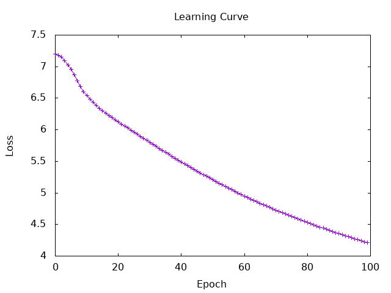

## 1.Build word2vec(CBOW)
Since learning all batches would be time consuming, I implemented a mini-batch learning.

```
  shuffledBatches <- shuffleM batches
  let miniBatches = chunks 10 shuffledBatches
```

epoch = 100  
learning rate = 0.1  
Sample.txt includes 100 lines and it took about 25 minutes to calculate.  
result:  
```
Epoch: 10, Batch: 100 | Loss: 6.702643
Epoch: 10, Batch: 200 | Loss: 6.392841
Epoch: 10, Batch: 300 | Loss: 6.1393266
Epoch: 10, Batch: 400 | Loss: 6.7223816
Epoch: 20, Batch: 100 | Loss: 6.3036127
Epoch: 20, Batch: 200 | Loss: 6.060809
Epoch: 20, Batch: 300 | Loss: 5.6194224
Epoch: 20, Batch: 400 | Loss: 6.4438124
Epoch: 30, Batch: 100 | Loss: 6.088128
Epoch: 30, Batch: 200 | Loss: 5.775381
Epoch: 30, Batch: 300 | Loss: 5.113452
Epoch: 30, Batch: 400 | Loss: 6.3943453
Epoch: 40, Batch: 100 | Loss: 5.7697673
Epoch: 40, Batch: 200 | Loss: 5.5104003
Epoch: 40, Batch: 300 | Loss: 4.7508173
Epoch: 40, Batch: 400 | Loss: 6.2182817
Epoch: 50, Batch: 100 | Loss: 5.4132757
Epoch: 50, Batch: 200 | Loss: 5.2305975
Epoch: 50, Batch: 300 | Loss: 4.5203667
Epoch: 50, Batch: 400 | Loss: 5.976045
Epoch: 60, Batch: 100 | Loss: 5.027351
Epoch: 60, Batch: 200 | Loss: 4.9617453
Epoch: 60, Batch: 300 | Loss: 4.331637
Epoch: 60, Batch: 400 | Loss: 5.7297187
Epoch: 70, Batch: 100 | Loss: 4.665637
Epoch: 70, Batch: 200 | Loss: 4.7576413
Epoch: 70, Batch: 300 | Loss: 4.150893
Epoch: 70, Batch: 400 | Loss: 5.494171
Epoch: 80, Batch: 100 | Loss: 4.368492
Epoch: 80, Batch: 200 | Loss: 4.60387
Epoch: 80, Batch: 300 | Loss: 3.9786124
Epoch: 80, Batch: 400 | Loss: 5.276637
Epoch: 90, Batch: 100 | Loss: 4.154204
Epoch: 90, Batch: 200 | Loss: 4.45188
Epoch: 90, Batch: 300 | Loss: 3.825529
Epoch: 90, Batch: 400 | Loss: 5.0833073
Epoch: 100, Batch: 100 | Loss: 4.014724
Epoch: 100, Batch: 200 | Loss: 4.2748404
Epoch: 100, Batch: 300 | Loss: 3.6979725
Epoch: 100, Batch: 400 | Loss: 4.910634
```
learning curve:  
  
  
I also tried to train on all the data, but gave up because it took nearly 10 hours to load file.  
  
## 3. Evaluate the trained model using STS
It did not work because the form of index and embedding were different and out-of-range access would occur, but when I created an index for a word that did not appear in the train, I could not implement it because I did not know how to align them because the form was always different.